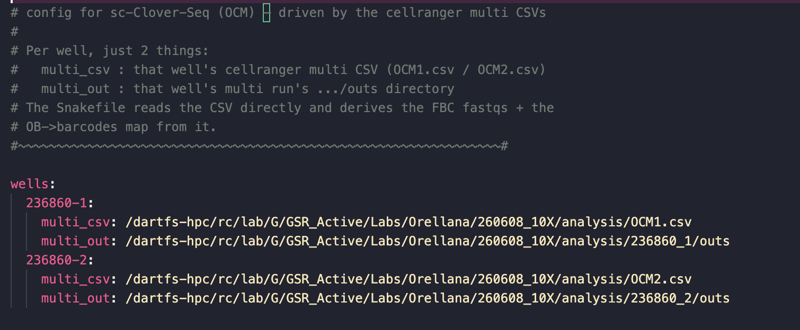

# Single-cell tRNA quantification (Clover-Seq extension, OCM)

The Single-cell Clover-Seq extension recovers per-cell tRNA expression from
10x On-Chip Multiplexing (OCM) sequencing data, implemented through
Snakemake for use on the Dartmouth `dartfs-hpc` cluster. It extends
[GDSC-Clover-Seq](https://github.com/Dartmouth-Data-Analytics-Core/GDSC-clover-Seq)
(bulk tRNA-seq) by adding cell-barcode/UMI awareness to its
`choosemappings.py` multi-mapping resolution step, recovering tRNA reads
that a standard scRNA-seq pipeline (Cell Ranger) systematically drops. Software dependencies are installed per rule by Snakemake
from the conda environment file in `env_config/`.

This pipeline assumes `cellranger multi` has already been run for every
pool; it reads that run's own `CSV` and `outs` directory directly (cell
calling, barcode whitelists, and the GEX/protein-coding side all come
from there) and never re-runs or replaces it.

## Documentation

- [Summary](#summary)
- [Installation](#installation)
- [Configuration](#configuration)
- [Quick Start](#quick-start)
- [Optional Features](#optional-features)
- [Understanding the Outputs](#understanding-the-outputs)
- [Contact](#contact)

## Summary

Currently the pipeline performs the following, per configured well:

- Pooling selected sequencing library or libraries (the dedicated
  tRNA-enriched small-RNA library, the gene-expression library, or both
  combined) across sequencing runs
- Cell barcode + UMI extraction from R1 using
  barcodes `cellranger multi` already identified as real cells
- Adapter/TSO trimming of R2 (`cutadapt`)
- Alignment to combined tRNA+genome Bowtie2 reference (`--local
  --very-sensitive`), with unmapped reads captured separately rather than discarded
- Multi-mapping resolution using Clover-Seq's unmodified `choosemappings.py`
- Per-cell, per-sample, UMI-deduplicated tRNA counts, at both isoacceptor
  and isodecoder level
- A flat, externally-numbered sample view across every well, plus a
  manifest mapping each external sample back to its well/internal origin
- Per-sample biotype composition reusing Clover-Seq's unmodified
  `count_all_smRNA.py`
- Pull-through of `cellranger multi` gene expression matrix, filtered to protein-coding genes, for combined tRNA + gene-expression analyses

## Installation

Clone the repository:

```bash
git clone https://github.com/Dartmouth-Data-Analytics-Core/GDSC-scClover-Seq
cd GDSC-scClover-Seq
```

Then get the shared Snakemake environment on your `PATH`:

```bash
conda activate /dartfs/rc/nosnapshots/G/GMBSR_refs/envs/snakemake
```

## Configuration

### Running `cellranger multi` (prerequisite, not part of this pipeline)

Each well's `multi_csv`/`multi_out` (below) comes from its own `cellranger
multi` run, submitted separately, before this pipeline ever starts. If
you haven't run it yet, `cellranger_multi_job.sh` (repository root) is a
ready-to-submit example, based on the exact SLURM array script used for
this dataset's own wells `236860-1`/`236860-2` (one array task per well,
`${SLURM_ARRAY_TASK_ID}` selecting that well's own CSV):

```bash
#!/bin/bash
#SBATCH --job-name=OCMarray
#SBATCH --nodes=1
#SBATCH --ntasks-per-node=1
#SBATCH --array=1-2
#SBATCH --cpus-per-task=16
#SBATCH --mem=64G
#SBATCH --time=8:00:00
#SBATCH --partition=standard
#SBATCH --mail-type=END,FAIL

module load cellranger
cellranger multi --id=236860_${SLURM_ARRAY_TASK_ID} --csv=OCM${SLURM_ARRAY_TASK_ID}.csv --localmem=128 --localcores=16
```

Run from the directory holding `OCM1.csv`/`OCM2.csv` (see the well
configuration example just below for what one of those CSVs contains).
`--id` becomes that well's pipestance directory name (`236860_1`,
`236860_2`), whose `outs/` subdirectory is what `multi_out` points at.
Adjust `--array`/`--id`/`--csv` for your own well names and count, and
add `--account=...`/adjust `--partition` for your own allocation.

```bash
sbatch cellranger_multi_job.sh
```

This is shown here for reference/reproducibility only — the Snakemake
pipeline itself reads `cellranger multi`'s outputs directly, it never
invokes `cellranger multi` itself.

### 1. Well configuration

Each **well** (e.g. `236860-1`) is described by its own `cellranger multi` CSV, 
which Snakemake parses directly. The `wells` block indicates the location of
the CSV and `outs` directory from the `cellRanger multi` run.



*The `wells:` block for this dataset's 2 wells (`236860-1`, `236860-2`) --
each key is a well name you choose, `multi_csv` points at that well's
`cellranger multi` CSV, `multi_out` at that well's `outs/` directory.*

> [!Important]
> What this pipeline calls a "well" is the final sequencing pool
> (`236860-1`, `236860-2`), not one of the OCM chip's own physical loading
> wells. The chip has 8 physical wells, but it multiplexes 4 samples into
> each final pool, so 2 pools come out of one chip run. Cell Ranger only
> accepts those 4 samples per pool being named `OB1`-`OB4`, which is why
> every `multi_csv` below only ever declares `OB1`-`OB4`, never more,
> regardless of how many pools exist. Any name beyond that (e.g. this
> pipeline's own external `OB5`-`OB8` numbering for a second pool) is
> assigned outside Cell Ranger.

| Field | Description |
|---|---|
| well name (key) | Short well identifier, e.g. `236860-1`. Any number of wells is supported. |
| `multi_csv` | Path to that well's `cellranger multi` CSV (e.g. `OCM1.csv`), listing both the sequencing libraries (`[libraries]`) and the OCM sample tags (`[samples]`, each with its own already-called-cells barcode list). |
| `multi_out` | Path to that well's `cellranger multi` `outs/` directory. |

An example `multi_csv` (well `236860-1`) is shown below. The Snakefile
only reads the `[libraries]` and `[samples]` sections; any other section
(here, `[gene-expression]`, Cell Ranger's own reference/create-bam
settings) is ignored. `[libraries]` can list the same library sequenced
across multiple runs (here, `run1` and `run2`); the pipeline pools them.

```csv
[gene-expression],,
reference,/dartfs-hpc/rc/lab/G/GSR_Active/scripts/refs/Mouse/mm10_smRNA,
create-bam,TRUE,
[libraries],,
fastq_id,fastqs,feature_types
236860-1_GEX1_DIL1,/dartfs-hpc/rc/lab/G/GSR_Active/Labs/Orellana/260608_10X/run1,gene expression
236860-1_GEX1,/dartfs-hpc/rc/lab/G/GSR_Active/Labs/Orellana/260608_10X/run2,gene expression
236860-1_GEX1_FBC1,/dartfs-hpc/rc/lab/G/GSR_Active/Labs/Orellana/260608_10X/run1,gene expression
236860-1_GEX1_FBC1,/dartfs-hpc/rc/lab/G/GSR_Active/Labs/Orellana/260608_10X/run2,gene expression
[samples],,
sample_id,ocm_barcode_ids,
1,OB1,
2,OB2,
3,OB3,
4,OB4,
```

### 2. Pipeline parameters

All settings are configured by `config.yaml`. At minimum, check the following
before a first run:

| Parameter | Description |
|---|---|
| `library_filter` | Which library or libraries to pool per well: `"FBC1"` (the dedicated tRNA-enriched library), `"all"` (GEX+FBC pooled, matching Cell Ranger's own input scope), or  `"GEX1"`. |
| `library_exclude` | A `fastq_id` token to exclude even if `library_filter` would otherwise include it. Use the placeholder `"__none__"` to exclude nothing (an empty string crashes Snakemake's config parser). |
| `results_dir` | Output root for a given run. Keep this distinct per `library_filter`/parameter combination so runs never overwrite each other (checked-in default: `fbc_only`). |
| `maxMaps` | Bowtie2 `-k`: max alignments reported per read before giving up on a repetitive locus (currently `100`). |
| `trna_db` / `bt2_index` | Prebuilt mm10 tRNA database and its Bowtie2 index. Only change for a different genome. |
| `bc_pattern` / `umi_separator` | Cell barcode + UMI structure (10x 3' v4: 16 bp CB + 12 bp UMI) and the separator used when appending them to read names. |
| `tso` / `adapter_1` / `minlength` | 5' TSO and 3' adapter/poly-A trimmed from R2 before Bowtie2 alignment, since Bowtie2 has no trimming of its own, unlike Cell Ranger's internal STAR step. `tso` is the 30 bp Template Switch Oligo 10x's own chemistry flanks every cDNA construct with (Cell Ranger trims this same sequence internally before its own alignment). |
| `smrna_gtf` / `reclass_gtf` | Gene annotation used for biotype classification (rule `sc_biotype_by_sample`) and protein-coding extraction (rule `sc_protein_coding_matrix`). |

### 3. Job submission scripts

`job_script.sh` (repository root) is the example submission script: it runs
Snakemake with `--profile cluster_profile`, which submits every rule as
its own separate `sbatch` job, sized to that rule's own declared
`threads`/`resources` (see `cluster_profile/config.yaml`), instead of one
job reserving a single large allocation upfront for the whole pipeline.

> [!Important]
> Check the `--partition` field (and add `--account=...` if your cluster
> requires one) at the top of `job_script.sh` before running it on your
> own allocation.


### 4. Submitting the job

The pipeline's main mode, FBC1-only tRNA recovery, is what `config.yaml`'s
own defaults already match:

```yaml
library_filter: "FBC1"
library_exclude: "__none__"
results_dir: fbc_only
```

```bash
snakemake --cores 16 --use-conda --conda-frontend conda --rerun-incomplete \
  --config library_filter=FBC1 library_exclude=__none__ results_dir=fbc_only \
  --snakefile Snakefile
```

`library_filter` matching is exact-token, not substring, so `"FBC1"` never
accidentally matches `"FBC2"` or a `"GEX1"`-only row.

| `library_filter` value | What gets pooled | Typical `results_dir` |
|---|---|---|
| `"FBC1"` | Dedicated small-RNA library only | `fbc_only` |
| `"all"` | GEX + FBC pooled, matching Cell Ranger's own input | `combined_gex_fbc` |
| `"GEX1"` | Gene-expression library only | `gex_only` |

Or just submit the already-configured example directly:

```bash
sbatch job_script.sh
```

## Quick Start

> [!Important]
> `cellranger multi` must already have been run for every well before
> starting here. This pipeline does not run it for you.

1. Edit the `wells` value in the `config.yaml` using the outputs of `cellRanger multi`(see
   [Configuration](#configuration)).
2. Edit `library_filter` and `results_dir` in the `config.yaml`(see
   [Configuration](#configuration)).
3. Submit `job_script.sh` to SLURM.

```bash
sbatch job_script.sh
```

## Optional Features

### Running just one rule

Ask Snakemake for a specific output file instead of the whole `rule all`;
it resolves the dependency graph for just that target, skipping any
upstream step whose output is already current. `{results_dir}` below is
whatever `results_dir` is set to (e.g. `fbc_only`).

| Rule | Output(s) | Produces |
|---|---|---|
| `pool_runs` | `{results_dir}/00_pool/{well}.R{1,2}.fastq.gz` | Reads pooled across sequencing runs/libraries for one well |
| `cell_whitelist` | `{results_dir}/00_pool/{well}.cell_whitelist.txt` | Union cell barcode whitelist for one well (all its OBs combined) |
| `barcode_extract` | `{results_dir}/01_barcode_tagged/{well}.R2.tagged.fastq.gz` | Cell barcode + UMI extracted from R1, embedded in R2 read names |
| `sc_trimming` | `{results_dir}/02_sc_alignment/{well}.R2.trim.fastq.gz` | TSO (5') + adapter/poly-A (3') trimmed R2 reads |
| `sc_tRNA_bowtie2` | `{results_dir}/02_sc_alignment/{well}.raw.bam`, `{well}.unmapped.fastq.gz` | Bowtie2 alignment to the tRNA+genome reference, plus reads that never aligned anywhere |
| `sc_tRNA_choosemappings` | `{results_dir}/02_sc_alignment/{well}.srt.bam` (+ `.bai`) | Best-mapping resolved, sorted/indexed BAM |
| `sc_tRNA_count` | `{results_dir}/03_tRNA_matrix/{well}/{ob}/matrix.mtx` (+ `barcodes.tsv`/`features.tsv`) | Per-cell tRNA UMI counts, isoacceptor level, one well/OB |
| `sc_tRNA_count_isodecoder` | `{results_dir}/03_tRNA_matrix/{well}/{ob}_isodecoder_{unique,primary}/matrix.mtx` | Same, isodecoder level |
| `sc_tRNA_by_sample_view` | `{results_dir}/03_tRNA_matrix_by_sample/{ext_ob}[_isodecoder_...]/matrix.mtx` | Flat OB1-OB8 view of the tRNA matrices above (symlinks, see `sample_manifest.tsv`) |
| `sc_biotype_split_bam` | `{results_dir}/02_sc_alignment/by_sample/biosample_{ext_ob}.srt.bam` | One well's resolved BAM split into one BAM per external sample |
| `sc_biotype_samplefile` | `{results_dir}/03_biotype_by_sample/samples.txt` | Samplefile listing all 8 external samples, for `sc_biotype_by_sample` |
| `sc_biotype_by_sample` | `{results_dir}/03_biotype_by_sample/biotype_by_sample_{raw,norm}.txt` | Per-sample biotype composition table (see [Understanding the Outputs](#understanding-the-outputs)) |
| `sc_protein_coding_matrix` | `{results_dir}/03_protein_coding_matrix_cellranger/{well}_{ob}/matrix.mtx` | Cell Ranger's own splice-aware protein-coding gene matrix, one well/OB |
| `sc_protein_coding_by_sample_view` | `{results_dir}/03_protein_coding_matrix_by_sample/{ext_ob}/matrix.mtx` | Flat OB1-OB8 view of the protein-coding matrices above |
| `sample_manifest` | `{results_dir}/sample_manifest.tsv` | Maps each external sample (`ext_ob`) back to its well/internal OB label |

Target a specific output file directly:

```bash
# rebuild only the isodecoder-level tRNA matrix for one well/OB (rule sc_tRNA_count_isodecoder)
snakemake --cores 4 --use-conda --conda-frontend conda \
  --config results_dir=fbc_only \
  --snakefile Snakefile \
  fbc_only/03_tRNA_matrix/236860-1/OB2_isodecoder_unique/matrix.mtx

# rebuild only the per-sample biotype composition table (rule sc_biotype_by_sample)
snakemake --cores 8 --use-conda --conda-frontend conda \
  --config results_dir=fbc_only \
  --snakefile Snakefile \
  fbc_only/03_biotype_by_sample/biotype_by_sample_raw.txt
```

Or target a rule by *name* with `--until`, if the upstream steps have
already run — this way you don't need to know that rule's exact output
filename, only its name from the table above:

```bash
snakemake --cores 8 --use-conda --conda-frontend conda \
  --config results_dir=fbc_only \
  --snakefile Snakefile \
  --until sc_biotype_by_sample
```


### Unmapped-read capture

Reads that never align anywhere in the tRNA+genome reference are written
to `{results_dir}/02_sc_alignment/{well}.unmapped.fastq.gz` alongside the
main alignment. This happens automatically as part of the normal
alignment rule; no extra target is needed to produce it.

> [!Note]
> Reads that DID align somewhere (a tRNA locus or not, ambiguous or not)
> are already fully characterized elsewhere: `choosemappings.py` doesn't
> drop them, it just picks a best reference, and the per-sample biotype
> table (`sc_biotype_by_sample`) already classifies every one of them.
> `unmapped.fastq.gz` is specifically the reads that reached neither.

## Understanding the Outputs

| Path | Contents |
|---|---|
| `{results_dir}/03_tRNA_matrix_by_sample/{OB}[_isodecoder_{unique,primary}]/` | Flat, externally-numbered per-sample tRNA count matrices (`matrix.mtx` + `barcodes.tsv` + `features.tsv`, `Read10X()`-compatible). This is what most downstream analysis reads from. |
| `{results_dir}/sample_manifest.tsv` | Maps each external sample (`ext_ob`) back to its well and internal OB label. |
| `{results_dir}/03_biotype_by_sample/biotype_by_sample_{raw,norm}.txt` | Per-sample biotype composition. The `protein_coding` row here should not be read as real mRNA capture: Bowtie2 isn't splice-aware, so it aligns equally well to a gene's introns as to its exons, and the classifier counts a read as `protein_coding` anywhere in that gene's full genomic span, not just the exons. |
| `{results_dir}/03_protein_coding_matrix_by_sample/{OB}/` | Same flat per-sample layout as the tRNA matrix, for Cell Ranger's own splice-aware protein-coding counts. |
| `{results_dir}/02_sc_alignment/{well}.unmapped.fastq.gz` | Reads that never aligned anywhere in the tRNA+genome reference; see [Unmapped-read capture](#unmapped-read-capture). |

## Contact

**Contact and questions**: Please address questions to [GDSC@groups.dartmouth.edu](mailto:GDSC@groups.dartmouth.edu) or submit an issue in the GitHub repository.

This pipeline extends [GDSC-Clover-Seq](https://github.com/Dartmouth-Data-Analytics-Core/GDSC-clover-Seq),
itself adapted from the [tRAX tool](https://github.com/UCSC-LoweLab/tRAX)
(GPL v3.0). If you use this pipeline, please cite:
[Holmes AD, Howard JM, Chan PP, and Lowe TM.](https://www.biorxiv.org/content/10.1101/2022.07.02.498565v1)
